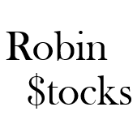

Robin-Stocks API Library
========================
This library provides a pure python interface to interact with the Robinhood API, Gemini API,
and TD Ameritrade API. The code is simple to use, easy to understand, and easy to modify.
With this library you can view information on stocks, options, and crypto-currencies in real time, 
create your own robo-investor or trading algorithm, and improve your programming skills.

To join our Slack channel where you can discuss trading and coding, click the link https://join.slack.com/t/robin-stocks/shared_invite/zt-7up2htza-wNSil5YDa3zrAglFFSxRIA

Supported APIs
==============
The supported APIs are Robinhood, Gemini, and TD Ameritrade. For more information about how to use the different APIs, visit the README
documents for `Robinhood Documentation`_, `Gemini Documentation`_, and `TDA Documentation`_.

Below are examples on how to call each of those modules.

>>> import robin_stocks.robinhood as rh
>>> import robin_stocks.gemini as gem
>>> import robin_stocks.tda as tda
>>> # Here are some example calls
>>> gem.get_pubticker("btcusd") # gets ticker information for Bitcoin from Gemini
>>> rh.get_all_open_crypto_orders() # gets all cypto orders from Robinhood
>>> tda.get_price_history("tsla") # get price history from TD Ameritrade 

Contributing
============
If you would like to contribute to this project, follow our contributing guidelines `Here <https://github.com/jmfernandes/robin_stocks/blob/master/contributing.md>`_.

Automatic Testing
^^^^^^^^^^^^^^^^^

If you are contributing to this project and would like to use automatic testing for your changes, you will need to install pytest and pytest-dotenv. To do this type into terminal or command prompt:

>>> pip install pytest
>>> pip install pytest-dotenv

You will also need to fill out all the fields in .test.env. I recommend that you rename the file as .env once you are done adding in all your personal information. After that, you can simply run:

>>> pytest

to run all the tests. If you would like to run specific tests or run all the tests in a specific class then type:

>>> pytest tests/test_robinhood.py -k test_name_apple # runs only the 1 test
>>> pytest tests/test_gemini.py -k TestTrades # runs every test in TestTrades but nothing else

Finally, if you would like the API calls to print out to terminal, then add the -s flag to any of the above pytest calls.

Installing
========================
There is no need to download these files directly. This project is published on PyPi,
so it can be installed by typing into terminal (on Mac) or into command prompt (on PC):

>>> pip install robin_stocks

Also be sure that Python 3 is installed. If you need to install python you can download it from `Python.org <https://www.python.org/downloads/>`_.
Pip is the package installer for python, and is automatically installed when you install python. To learn more about Pip, you can go to `PyPi.org <https://pypi.org/project/pip/>`_.

If you would like to be able to make changes to the package yourself, clone the repository onto your computer by typing into terminal or command prompt:

>>> git clone https://github.com/jmfernandes/robin_stocks.git
>>> cd robin_stocks

Now that you have cd into the repository you can type

>>> pip install .

and this will install whatever you changed in the local files. This will allow you to make changes and experiment with your own code.

List of Functions and Example Usage
===================================

For a complete list of all Robinhood API functions and what the different parameters mean, 
go to `robin-stocks.com Robinhood Page <http://www.robin-stocks.com/en/latest/robinhood.html>`_. If you would like to
see some example code and instructions on how to set up two-factor authorization for Robinhood,
go to the `Robinhood Documentation`_.

For a complete list of all TD Ameritrade API functions and what the different parameters mean, 
go to `robin-stocks.com TDA Page <http://www.robin-stocks.com/en/latest/tda.html>`_. For detailed instructions on 
how to generate API keys for TD Ameritrade and how to use the API, go to the `TDA Documentation`_.

For a complete list of all Gemini API functions and what the different parameters mean, 
go to `robin-stocks.com Gemeni Page <http://www.robin-stocks.com/en/latest/gemini.html>`_. For detailed instructions on 
how to generate API keys for Gemini and how to use both the private and public API, go to the `Gemini Documentation`_.

.. _Robinhood Documentation: Robinhood.rst
.. _Gemini Documentation: gemini.rst
.. _TDA Documentation: tda.rst