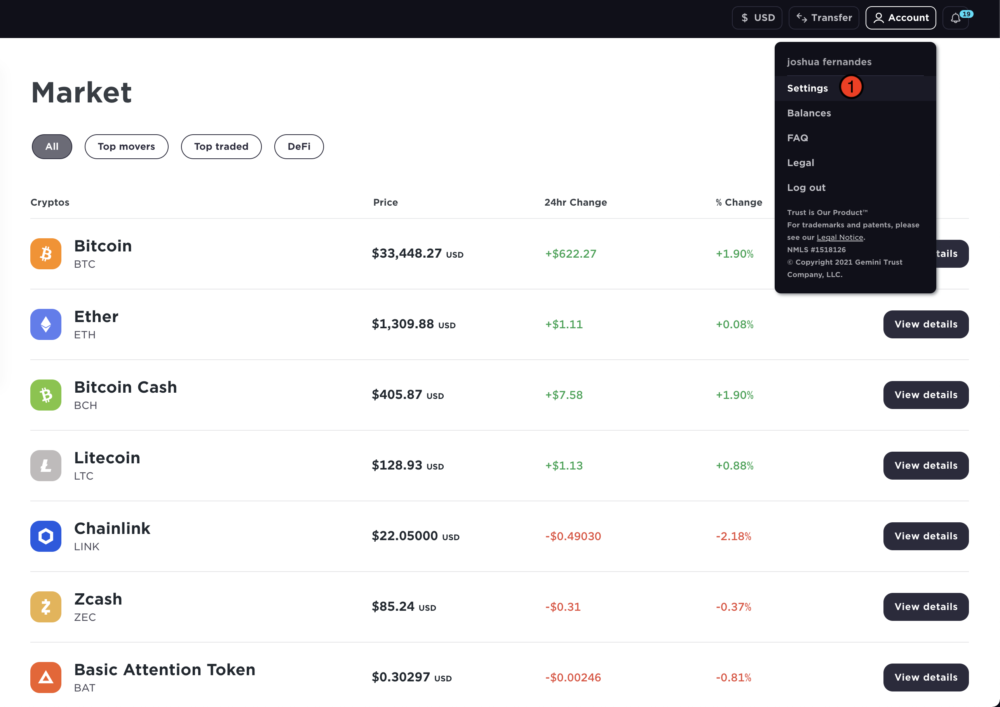
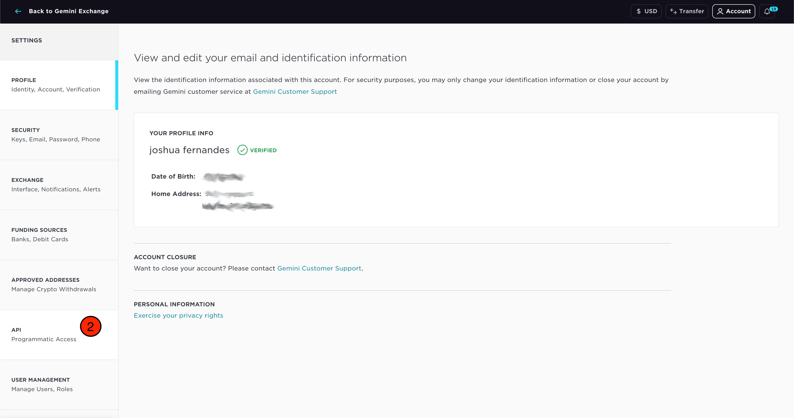
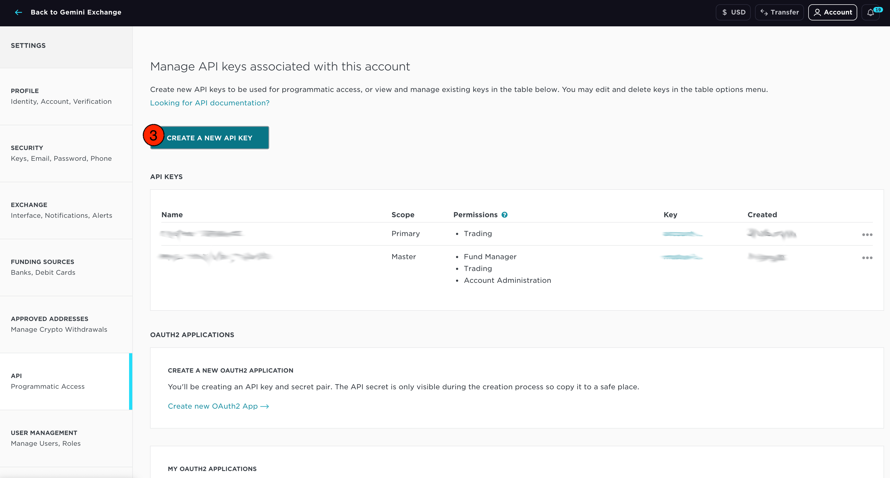
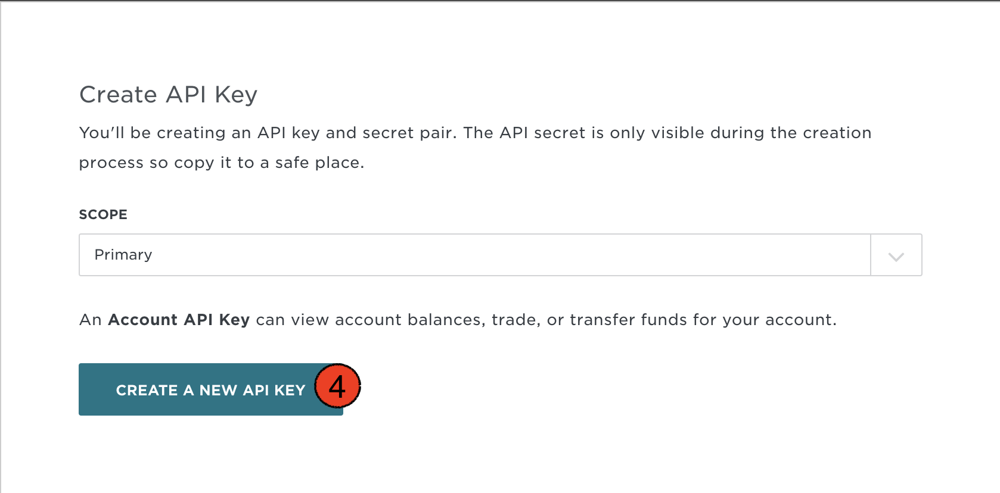
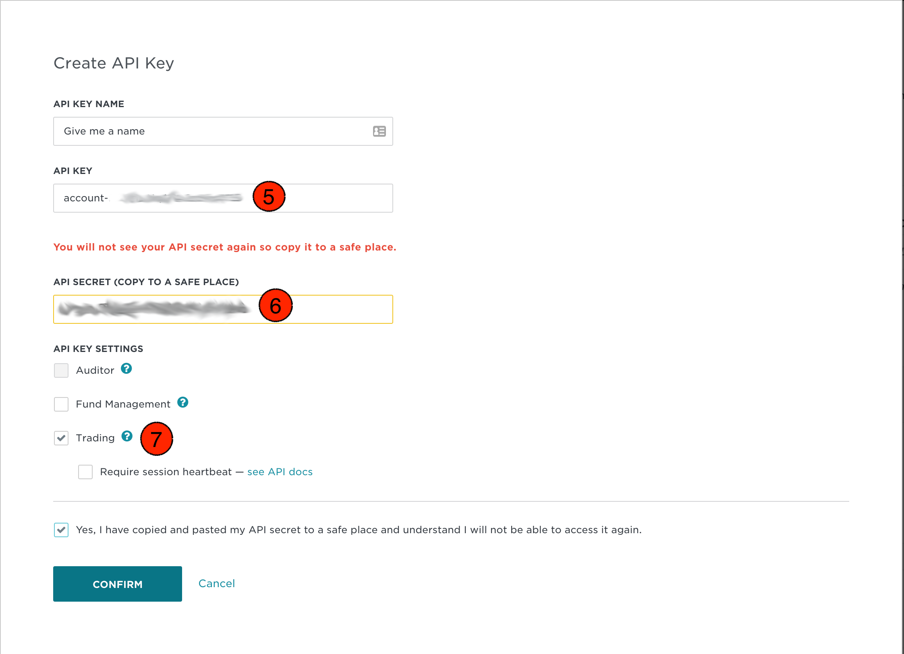

Example Usage of Gemini API
===========================
Gemini has a public API where you can make requests without any authorization keys and 
a private API where each request needs authroization codes.

Create account API keys
^^^^^^^^^^^^^^^^^^^^^^^
Gemini uses two API keys, one called the API key and one called the secret key. In order to use the Gemini
private API to place orders, view account activity, etc. You will need to generate these keys on their website.
Make sure you generate an account key and not a master key. This library does not currently support master keys.
Below are pictures on how to do that. You will also need to call the login function before you can call
any of the functions that use the private API. If you are not logged in, any function that requires your
API keys will raise an exception telling you to login.

Heartbeat
^^^^^^^^^
When creating an API key, you can also check the box that says 'require heartbeat' in step 7 below. This 
sets your session so that any unfilled orders will be cancelled if you don't ping the API every 30 seconds.
The easiest way to ping the API is with the heartbeat() function.

Sandbox Mode
^^^^^^^^^^^^
If you want to send API calls to a sandbox account with a lot of fake money and cryptos to play around with,
then call the use_sand_box_urls() function.

Logging in
^^^^^^^^^^
Loggin in is very simple. Just type

>>> import robin_stocks.gemini as g
>>> g.login("account-apigoeshere", "secret-api-goes-here")

Be aware that only functions that are decorated with @login_required need you to be logged in.
The rest can be called without you having to login.