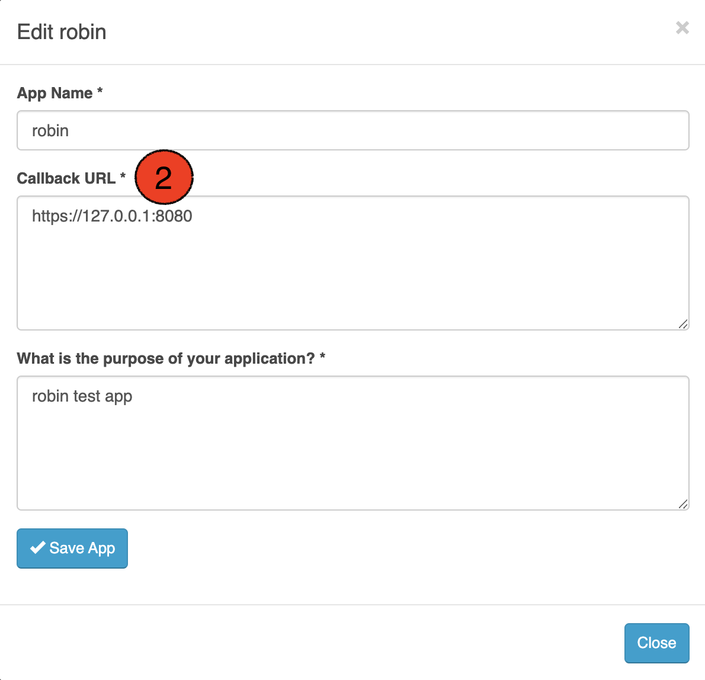
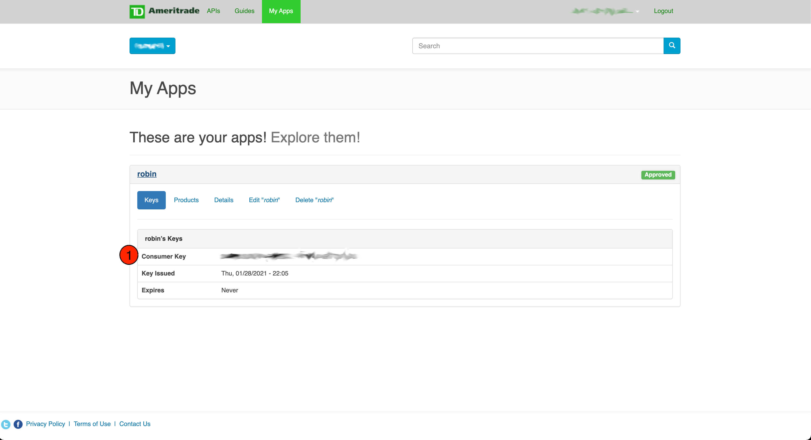
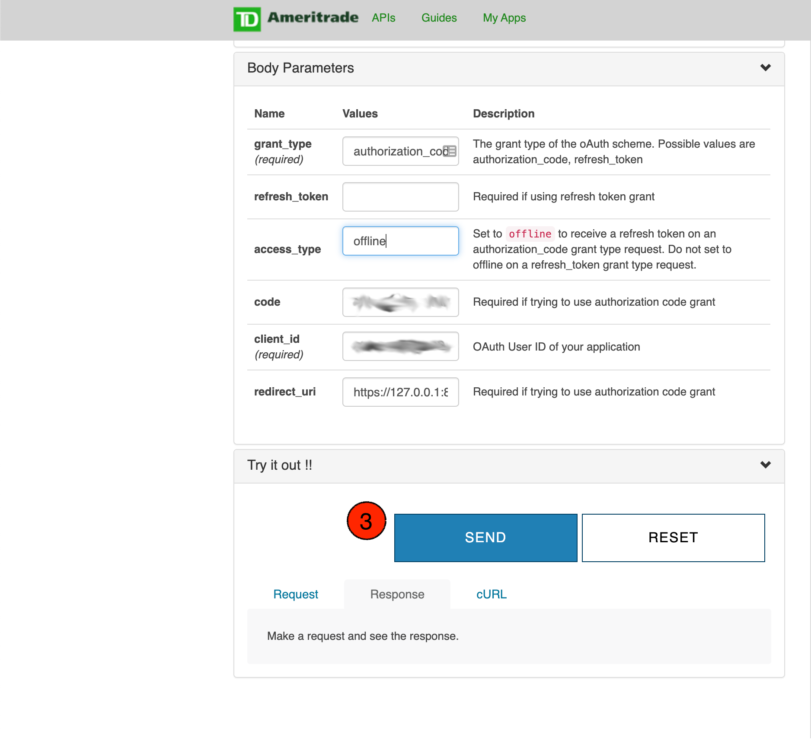
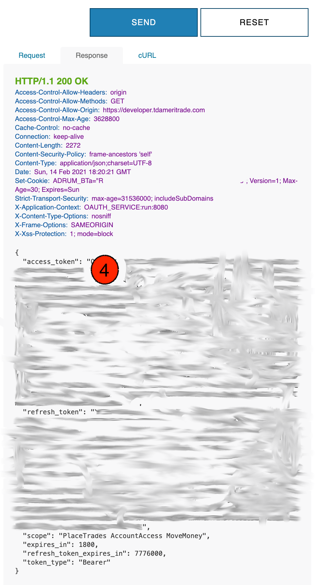

Example Usage of TD Ameritrade API
===========================
TD Ameritrade take a little work to get up and running, but once you set it up the first time,
you should be able to log in automatically every time after that.

Loggin in to API
^^^^^^^^^^^^^^^^
The first thing you need to do is create an encryption passcode. Robin-Stocks stores your confidential
API information in a pickle file on your computer, and encrypts it using a password for your own safety.
To generate this passcode, execute the following code.

>>> import robin_stocks.tda as tda
>>> passcode = tda.generate_encryption_passcode()
>>> print("my secret passcode is ", passcode)

Write this passcode down and store it in a safe place. You can store the passcode in a .env file as 
shown in .test.env. In this example, the passcode is stored as tda_encryption_passcode and if you
wanted to get the value in your personal scripts you would execute the following code.

>>> import os
>>> from dotenv import load_dotenv
>>> load_dotenv()
>>> my_secret_passcode = os.environ["tda_encryption_passcode"]

Now you are free to use my_secret_passcode variable to log in to the TD Ameritrade API. To log in to
the API, you will need four things: your encryption passcode, the consumer key of your API account, 
an authentication token that is generated on the TD Ameritrade API website, 
and a refresh token that is also generated on the TD Ameritrade API website.
To log in for the first time, execute the following code.

>>> import robin_stocks.tda as tda
>>> tda.login_first_time("my-encryption-passcode", "my-application-consumer-key",
>>>     "my-authroization-token", "my-refresh-token") # ONLY CALL ME ONCE. EVER.

Please be sure that you do not call login_first_time every time you run a script. You run it only once, 
and then you should delete the code from your python file. A better solution would be to enter the python interpreter 
in Terminal or Windows Command Prompt and to execute the login_first_time function from there. login_first_time will save 
the authentication and refresh token to a pickle file in your home directory. Authorization tokens expire every 30 minutes, 
and the refresh token is used by robin_stocks to get you a new authentication token.

So, at the start of every TD Ameritrade script or program you write, you should execute the following code.

>>> import robin_stocks.tda as tda
>>> tda.login("my-encryption-passcode") # make sure you have called login_first_time as some point.

The login function will use your encryption passcode to decrypt your pickle file, generate a new authorization token 
if it needs to, and then save your authorization to the requests session information. 

There is an example log in script in the examples folder `Here`_.

Getting Authorization and Refresh Code
^^^^^^^^^^^^^^^^^^^^^^^^^^^^^^^^^^^^^^
You will need to manually create your first authorization and refresh code using the TD Ameritrade website. Go to 
https://developer.tdameritrade.com/ and create a developer account. Click on "My Apps" on the top of the home page, 
and then click on "Add a new App". Choose your own name and description, but enter the url exactly as it is shown in 
the picture below.

Click the "Create App" button and you will be taken to a dashboard that will list all your available API keys. You 
should see the name of the app you just created. Click on it and you should see the image below.

Take special note of the Consumer Key. This is sometimes referred to as the "client id" or "api key", but this is one of 
the key pieces of information you need when logging in for the first time. Now that you have your consumer key, copy and paste 
the following url into a new web broswer window, and substitute your consumer key for CONSUMER-KEY-GOES-HERE.

>>> https://auth.tdameritrade.com/oauth?client_id=CONSUMER-KEY-GOES-HERE%40AMER.OAUTHAP&response_type=code&redirect_uri=https%3A%2F%2F127.0.0.1%3A8080

You should be prompted with a TD Ameritrade log in screen. Log in with your regular TDA account, not your developer account credentials. 
After you successfully log in, you will be redirected to blank page, but you will notice that the url in the address bar has changed. The 
url should look like the following. 

>>> https://127.0.0.1:8080/?code=0GbsbpDPy2nK2x2xjUe5PFeXSm # code is a lot longer that this.

Now you want to take everything that appears after "code=" and write it down somewhere. The next step is very important. The sequence of 
characters in the url has been encoded so that characters like "/" appear as "%2F". Go to https://www.urldecoder.org/ and decode the 
code string to get the actual value you will need to get your authorization token. Now go to https://developer.tdameritrade.com/authentication/apis/post/token-0 and fill out all the necessary information to get your authorization token. An example of what to fill out is shown below.

If you filled everything out correctly, then you will see the following response. congratulations you have your authorization and refresh tokens.

.. _Here: examples/tda%20examples/basic_authentication.py